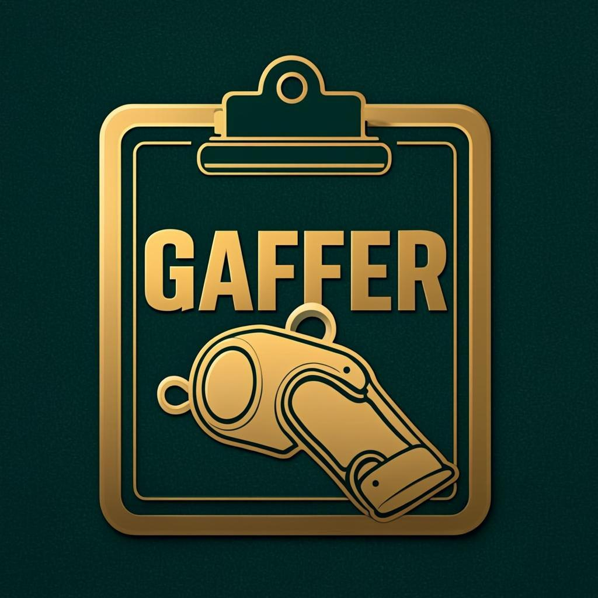

<div align="center">



[](https://www.gnu.org/licenses/gpl-3.0)
[](https://www.rust-lang.org/)
[](https://tauri.app/)
[](https://react.dev/)

**Tactics. Touchlines. Trophies.**

A free, desktop football management simulation built for the purist.

[Features](#features) • [Installation](#installation--development) • [Contributing](#contributing) • [License](#license)

Join the community on Discord: https://discord.gg/2CXaesaukT

</div>

---

## Welcome to the Dugout

**Gaffer** is a free, open-source football manager game — the kind where you'll spend hours tinkering with your back four, arguing with the board over the transfer kitty, and telling the lads to "just get round the back" in the 89th minute.

We don't do raw numbers here. Every player rating, every morale level, every attribute tier is spoken in **Gaffer voice** — the language of the terrace, the dressing room, and the post-match pint. Your striker isn't "OVR 88." He's **"Top-drawer — a proper handful on his day."** Your midfielder isn't "stamina 75." He's a **"workhorse who'll run all day."**

## Features

### The Match Day
- **19-attribute player system** with four groups — The Body, The Ball, The Head, The Gloves
- **Match engine** with weather conditions, fixture importance (from Friendly to Continental Final), and pressure situations that test composure when it matters most
- **Live match mode** — make subs, change formation, shout from the touchline
- **Sparse simulator** for AI-vs-AI matches — fast enough to sim a full matchday in seconds
- **Match highlights** — the key moments told in Gaffer voice, not a stat dump

### The Transfer Market
- **Real player database** — 5,324 real players across 184 clubs and 21 competitions
- **AI transfer market** with star-player appeal, not-for-sale logic, wonderkid premiums, and deadline-day drama
- **Player club appeal** — players refuse to join small clubs, demand premiums for cold countries
- **Release clauses, loan system, tapping up** — the full toolbox of modern football's dark arts

### The World
- **AI manager personalities** — Guardiola-type possession men vs Allardyce-type direct merchants, each training their squads differently
- **Multi-season vitality** — players age, retire, get replaced by academy graduates; staff retire; rivalries build; the Hall of Fame grows
- **Player career stories** — debut, first goal, milestone appearances, loan spells, breakthroughs
- **Player partnerships** — strikers who score together build a chemistry bonus over time
- **Narrative memory** — the game remembers breakout performances and resurfaces them months later
- **Board types** — Sugar Daddy, Sensible, Penny-Pinching, Ambitious — each with different budgets and patience

### The Dugout
- **Tactics board** with Phase Blueprint — 9 tactical dials (build-up style, width, tempo, pressing, defensive shape, marking, counter-press, break speed, defensive line)
- **Training ground** with weekly cycles driven by your manager's tactical style
- **Scouting network** with progressive 3-tier reveal (Surface → Detailed → Complete)
- **Backroom staff** — coaches, scouts, physios, assistant managers, each with real attributes
- **Press conferences** and **manager mind games** before rivalries

### The Voice
- **No raw numbers in the UI** — everything speaks football: "Electric pace," "Clinical finisher," "Match fit," "Running on empty"
- **Gaffer interpretation engine** — position-aware attribute descriptions (a CB's "pace" is "Recovery Pace," a winger's is "In Behind")
- **11-language support** — English, Spanish, Portuguese, French, German, Italian, Russian, Chinese, Czech, Turkish, Brazilian Portuguese

## Architecture

Built on a foundation of proper engineering:

- **Rust** — Match engine, game state, AI, and all simulation logic. Six crates: `domain`, `engine`, `ofm_core`, `db`, `sim-bench`, `ofm-cli`.
- **Tauri 2** — Lightweight desktop shell. No Electron bloat.
- **React 19 + TypeScript + Tailwind v4** — Fast, responsive frontend with a football-styled design system.
- **SQLite** — Per-save databases with 46 migrations. Your saves are local, portable, and yours.

*Built on the OpenFootManager project.*

## Installation & Development

You'll need standard tools for Rust, Node, and Tauri development:

1. Install **Rust** (via `rustup`)
2. Install **Node.js** (v18+)
3. Install Tauri dependencies for your OS (see the [Tauri Prerequisites Guide](https://v2.tauri.app/start/prerequisites/))

Clone and install:

```bash
git clone https://github.com/anthonycarre00-collab/gaffer-v99.git
cd gaffer-v99
npm install
```

Run the development build:

```bash
npm run tauri dev
```

Or use the build script (Windows):

```bash
run-and-build.bat
```

## Contributing

Contributions welcome. Read [CONTRIBUTING](CONTRIBUTING.md) for full guidelines.

Join the Discord for discussion: https://discord.gg/2CXaesaukT

Quick checklist:

1. Open an Issue first for bugs, enhancements, or larger features.
2. Work from a feature branch and open Pull Requests targeting `main`.
3. Run tests before submitting:

```bash
npm test
cd src-tauri
cargo test --workspace
```

## License

    Gaffer - A free and open source football management game
    Copyright (C) 2020-2026  Pedrenrique G. Guimarães

    This program is free software: you can redistribute it and/or modify
    it under the terms of the GNU General Public License as published by
    the Free Software Foundation, either version 3 of the License, or
    (at your option) any later version.

    This program is distributed in the hope that it will be useful,
    but WITHOUT ANY WARRANTY; without even the implied warranty of
    MERCHANTABILITY or FITNESS FOR A PARTICULAR PURPOSE.  See the
    GNU General Public License for more details.

    You should have received a copy of the GNU General Public License
    along with this program.  If not, see <http://www.gnu.org/licenses/>.

Check [LICENSE](LICENSE.md) for more information.
